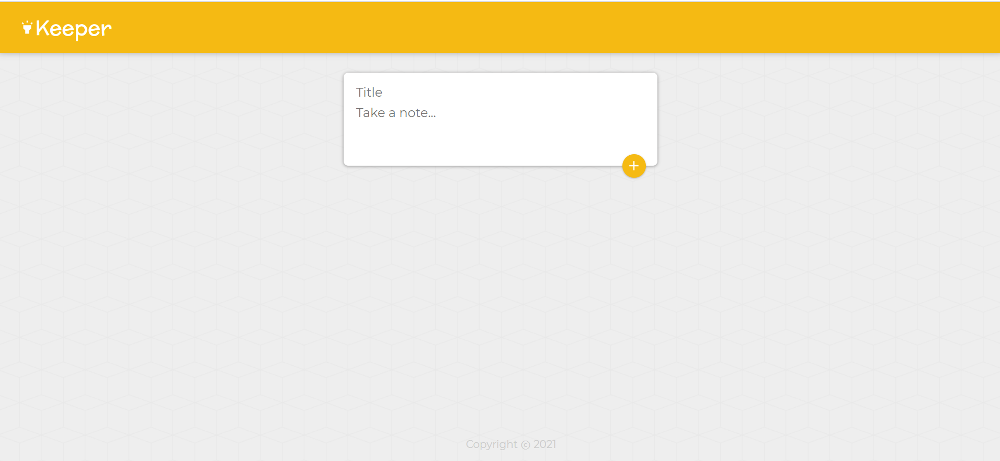
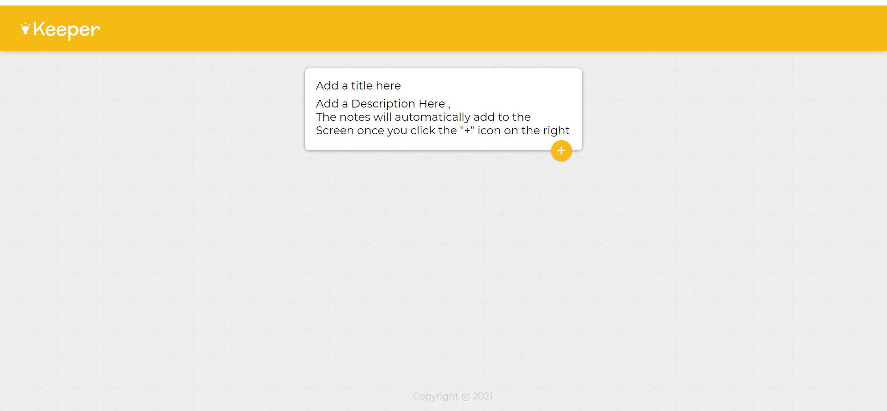
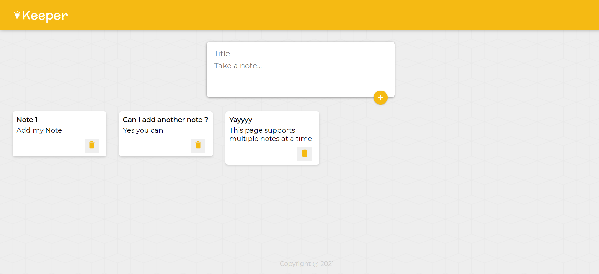
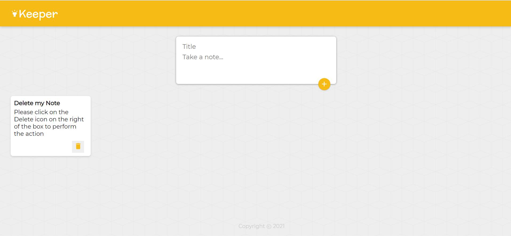

# GoogleKeep Clone ReactJs

> Google Keep Clone Frontend Only Application made using ReactJS

## Features

- A beautiful UI
- Addition of multiple notes at a time
- Supports rendering of all the notes at the same time once it's added
- Supports Deletion of Notes directly on the frontend

## Usage

### Install Dependencies

```
npm install
```

### Run

```
# Run Application (:3000)
npm start to run the app on PORT 3000


```

Snapshots of the project 👇

The full overview of the App


Add Note to your App


Add Multiple Notes to Your App


Delete your notes from the App

